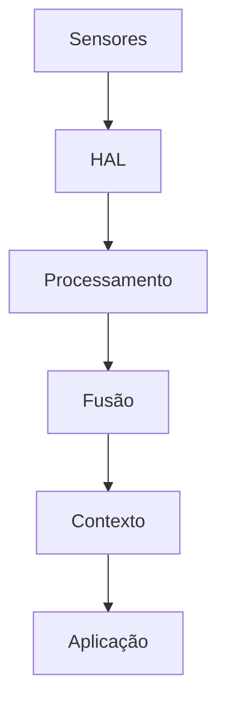

## Page 1

# AURORA SENSE: Arquitetura Otimizada para Integração Total de Sensores do Samsung Galaxy S25

---

Um Framework Inovador para Aproveitamento Máximo de Todos os Sensores e Recursos de Hardware

**Autor:** AURORA AI - Sistema de Inteligência Autônoma Universal
**Data:** 24 de dezembro de 2024
**Versão:** 1.0 - Arquitetura Completa

---

## Resumo Executivo

Este documento apresenta o **AURORA SENSE**, uma arquitetura inovadora e otimizada para integração e aproveitamento máximo de todos os sensores e recursos de hardware disponíveis no Samsung Galaxy S25. O modelo propõe uma abordagem hierárquica de fusão de sensores com configuração automática, processamento em tempo real e consciência contextual completa.

A arquitetura é projetada para operar como um “sistema nervoso digital” que integra 20+ sensores em um framework unificado, permitindo aplicações avançadas de consciência situacional, monitoramento de saúde, navegação precisa e interação inteligente com o ambiente.

---

## Índice

1. Visão Geral da Arquitetura
2. Inventário Completo de Sensores
3. Camadas da Arquitetura

---


## Page 2

4. Sistema de Fusão de Sensores
5. Configuração Automática
6. Módulos Funcionais
7. Implementação Técnica
8. Casos de Uso e Aplicações
9. Otimização de Energia
10. Especificações de API

---

# 1. Visão Geral da Arquitetura

## 1.1 Filosofia de Design

O AURORA SENSE é baseado em três princípios fundamentais que guiam toda a arquitetura:

**Integração Total:** Todos os sensores do dispositivo são tratados como um sistema unificado, não como componentes isolados. A informação de cada sensor enriquece e valida os dados dos demais, criando uma compreensão holística do ambiente e do usuário.

**Consciência Contextual:** O sistema mantém um modelo interno do contexto atual (localização, atividade, ambiente, estado do usuário) que é continuamente atualizado e usado para otimizar a operação de todos os componentes.

**Eficiência Adaptativa:** Os recursos são alocados dinamicamente com base nas necessidades do momento, balanceando precisão, latência e consumo de energia de forma inteligente.

---


## Page 3

# 1.2 Diagrama de Arquitetura de Alto Nível

<mermaid>
graph TD
    subgraph "AURORA SENSE - Arquitetura"
        subgraph "CAMADA DE APLICAÇÃO"
            SAude[Saúde]
            Navegacao[Navegação]
            Ambiente[Ambiente]
            Seguranca[Segurança]
        end
        subgraph "CAMADA DE CONSCIÊNCIA CONTEXTUAL"
            MCU[Modelo de Contexto Unificado (MCU)]
            EstadoDoUsuario[• Estado do Usuário]
            Ambiente[• Ambiente]
            Atividade[• Atividade]
        end
        subgraph "CAMADA DE FUSÃO DE SENSORES"
            Kalman[Kalman<br>Filter]
            Particle[Particle<br>Filter]
            Bayesian[Bayesian<br>Fusion]
            DeepFusion[Deep<br>Fusion]
        end
        subgraph "CAMADA DE PROCESSAMENTO DE SINAL"
            Filtros[Filtros]
            FFT[FFT]
            Calibracao[Calibração]
            Validacao[Validação]
        end
        subgraph "CAMADA DE ABSTRAÇÃO DE HARDWARE"
            Accel[Accel]
            Gyro[Gyro]
            Mag[Mag]
            Baro[Baro]
            GPS[GPS]
            PPG[PPG]
            Light[Light]
            Prox[Prox]
        end
    end
</mermaid>

---


## Page 4

# 2. Inventário Completo de Sensores

## 2.1 Sensores de Movimento (IMU)

<table>
  <thead>
    <tr>
      <th>Sensor</th>
      <th>Modelo Típico</th>
      <th>Taxa de Amostragem</th>
      <th>Resolução</th>
      <th>Consumo</th>
    </tr>
  </thead>
  <tbody>
    <tr>
      <td>Acelerômetro</td>
      <td>LSM6DSO</td>
      <td>1.6 Hz - 6.66 kHz</td>
      <td>16 bits</td>
      <td>0.55 mA</td>
    </tr>
    <tr>
      <td>Giroscópio</td>
      <td>LSM6DSO</td>
      <td>12.5 Hz - 6.66 kHz</td>
      <td>16 bits</td>
      <td>0.55 mA</td>
    </tr>
    <tr>
      <td>Magnetômetro</td>
      <td>AK09918</td>
      <td>10 Hz - 100 Hz</td>
      <td>16 bits</td>
      <td>1.1 mA</td>
    </tr>
  </tbody>
</table>

## 2.2 Sensores Ambientais

<table>
  <thead>
    <tr>
      <th>Sensor</th>
      <th>Modelo Típico</th>
      <th>Faixa</th>
      <th>Resolução</th>
      <th>Consumo</th>
    </tr>
  </thead>
  <tbody>
    <tr>
      <td>Barômetro</td>
      <td>BMP390</td>
      <td>300-1250 hPa</td>
      <td>0.01 hPa</td>
      <td>3.4 µA</td>
    </tr>
    <tr>
      <td>Luz Ambiente</td>
      <td>TSL2591</td>
      <td>0-88000 lux</td>
      <td>16 bits</td>
      <td>0.4 mA</td>
    </tr>
    <tr>
      <td>Proximidade</td>
      <td>VL53L1X</td>
      <td>0-4000 mm</td>
      <td>1 mm</td>
      <td>20 mA</td>
    </tr>
    <tr>
      <td>Temperatura</td>
      <td>Integrado</td>
      <td>-40 a 85°C</td>
      <td>0.1°C</td>
      <td>-</td>
    </tr>
    <tr>
      <td>Umidade</td>
      <td>Integrado</td>
      <td>0-100% RH</td>
      <td>1%</td>
      <td>-</td>
    </tr>
  </tbody>
</table>

## 2.3 Sensores de Posicionamento

<table>
  <thead>
    <tr>
      <th>Sensor</th>
      <th>Constelações</th>
      <th>Precisão</th>
      <th>Consumo</th>
    </tr>
  </thead>
  <tbody>
    <tr>
      <td>GNSS</td>
      <td>GPS, GLONASS, Galileo, BeiDou, QZSS</td>
      <td>1-3 m</td>
      <td>25 mA</td>
    </tr>
    <tr>
      <td>UWB</td>
      <td>IEEE 802.15.4z</td>
      <td>10 cm</td>
      <td>35 mA</td>
    </tr>
  </tbody>
</table>

---


## Page 5

# 2.4 Sensores Biométricos

<table>
  <thead>
    <tr>
      <th>Sensor</th>
      <th>Tecnologia</th>
      <th>Precisão</th>
      <th>Consumo</th>
    </tr>
  </thead>
  <tbody>
    <tr>
      <td>Impressão Digital</td>
      <td>Ultrassônico 3D</td>
      <td>99.9%</td>
      <td>10 mA</td>
    </tr>
    <tr>
      <td>Frequência Cardíaca</td>
      <td>PPG (LED verde)</td>
      <td>±2 bpm</td>
      <td>5 mA</td>
    </tr>
    <tr>
      <td>SpO2</td>
      <td>PPG (LED vermelho/IR)</td>
      <td>±2%</td>
      <td>5 mA</td>
    </tr>
  </tbody>
</table>

# 2.5 Sensores de Conectividade

<table>
  <thead>
    <tr>
      <th>Sensor</th>
      <th>Padrão</th>
      <th>Velocidade</th>
      <th>Alcance</th>
    </tr>
  </thead>
  <tbody>
    <tr>
      <td>Wi-Fi</td>
      <td>802.11be (Wi-Fi 7)</td>
      <td>46 Gbps</td>
      <td>100 m</td>
    </tr>
    <tr>
      <td>Bluetooth</td>
      <td>5.4</td>
      <td>2 Mbps</td>
      <td>400 m</td>
    </tr>
    <tr>
      <td>NFC</td>
      <td>ISO 14443</td>
      <td>424 kbps</td>
      <td>10 cm</td>
    </tr>
    <tr>
      <td>5G</td>
      <td>mmWave + sub-6GHz</td>
      <td>10 Gbps</td>
      <td>Variável</td>
    </tr>
  </tbody>
</table>

# 2.6 Sensores de Imagem

<table>
  <thead>
    <tr>
      <th>Sensor</th>
      <th>Resolução</th>
      <th>Tamanho Pixel</th>
      <th>Abertura</th>
    </tr>
  </thead>
  <tbody>
    <tr>
      <td>Principal</td>
      <td>200 MP</td>
      <td>0.6 µm</td>
      <td>f/1.7</td>
    </tr>
    <tr>
      <td>Ultra-wide</td>
      <td>12 MP</td>
      <td>1.4 µm</td>
      <td>f/2.2</td>
    </tr>
    <tr>
      <td>Telefoto</td>
      <td>50 MP</td>
      <td>0.7 µm</td>
      <td>f/2.4</td>
    </tr>
    <tr>
      <td>Frontal</td>
      <td>12 MP</td>
      <td>1.22 µm</td>
      <td>f/2.2</td>
    </tr>
  </tbody>
</table>

# 3. Camadas da Arquitetura

## 3.1 Camada de Abstração de Hardware (HAL)

A HAL fornece uma interface unificada para todos os sensores, abstraindo as diferenças de hardware e protocolos de comunicação.

---


## Page 6

# Interface Unificada de Sensor:

```typescript
interface SensorReading {
  sensorId: string;
  timestamp: number; // Microsegundos desde boot
  accuracy: SensorAccuracy; // LOW, MEDIUM, HIGH, UNRELIABLE
  values: number[]; // Valores do sensor
  metadata: SensorMetadata; // Informações adicionais
}

interface SensorConfig {
  samplingRate: number; // Hz
  batchSize: number; // Amostras por lote
  reportLatency: number; // ms
  powerMode: PowerMode; // LOW, NORMAL, HIGH_PERFORMANCE
  calibrationMode: CalibrationMode;
}
```

# Gerenciador de Sensores:

```typescript
class SensorManager {
  // Registro e descoberta de sensores
  getSensorList(): Sensor[];
  getSensorById(id: string): Sensor | null;

  // Configuração
  configure(sensorId: string, config: SensorConfig): void;
  calibrate(sensorId: string): Promise<CalibrationResult>;

  // Leitura de dados
  subscribe(sensorId: string, callback: (reading: SensorReading) => void): Subscription;
  getLatestReading(sensorId: string): SensorReading;

  // Controle de energia
  setPowerMode(sensorId: string, mode: PowerMode): void;
  getSensorPowerConsumption(sensorId: string): number; // mW
}

---


## Page 7

# 3.2 Camada de Processamento de Sinal

Esta camada aplica filtros, calibração e validação aos dados brutos dos sensores.

## Pipeline de Processamento:

[Dados Brutos] → [Validação] → [Calibração] → [Filtros] → [Normalização] → [Dados Processados]

## Filtros Implementados:

<table>
  <thead>
    <tr>
      <th>Filtro</th>
      <th>Aplicação</th>
      <th>Equação</th>
    </tr>
  </thead>
  <tbody>
    <tr>
      <td>Passa-baixa</td>
      <td>Remoção de ruído</td>
      <td>y[n] = αx[n] + (1-α)y[n-1]</td>
    </tr>
    <tr>
      <td>Passa-alta</td>
      <td>Detecção de movimento</td>
      <td>y[n] = α(y[n-1] + x[n] - x[n-1])</td>
    </tr>
    <tr>
      <td>Kalman</td>
      <td>Estimação de estado</td>
      <td>x⊗⊗ = F⊗x⊗⊗⊗⊗₁ + K⊗(z⊗ - H⊗x⊗⊗⊗⊗₁)</td>
    </tr>
    <tr>
      <td>Complementar</td>
      <td>Fusão accel/gyro</td>
      <td>θ = α(θ + ω · dt) + (1-α)θ_accel</td>
    </tr>
    <tr>
      <td>Mediana</td>
      <td>Remoção de outliers</td>
      <td>y = median(x[n-k:n+k])</td>
    </tr>
  </tbody>
</table>

## Calibração Automática:

O sistema implementa calibração automática contínua para todos os sensores:

---


## Page 8

typescript
interface CalibrationParameters {
  // Acelerômetro
  accelBias: Vector3; // Offset em cada eixo
  accelScale: Matrix3x3; // Matriz de escala e alinhamento

  // Giroscópio
  gyroBias: Vector3; // Drift em cada eixo
  gyroTempCoeff: Vector3; // Compensação de temperatura

  // Magnetômetro
  magHardIron: Vector3; // Offset de hard iron
  magSoftIron: Matrix3x3; // Correção de soft iron

  // Barômetro
  baroOffset: number; // Offset de pressão
  baroTempCoeff: number; // Compensação de temperatura
}
```

# 3.3 Camada de Fusão de Sensores

A fusão de sensores combina dados de múltiplos sensores para obter estimativas mais precisas e robustas.

## Filtro de Kalman Estendido (EKF) para Orientação:

O EKF é usado para fusão de acelerômetro, giroscópio e magnetômetro:

**Estado:** x = [q₀, q₁, q₂, q₃, bωₓ, bωᵧ, bωz]ᵀ (quaternion + bias do giroscópio)

**Modelo de Processo:**

$$\dot{q} = \frac{1}{2} q \otimes \omega$$

**Modelo de Observação:**

$$z_{accel} = R(q)^T \cdot g$$

$$z_{mag} = R(q)^T \cdot m$$

**Equações do EKF:**

**Predição:** $$\hat{x}_{k|k-1} = f(\hat{x}_{k-1|k-1}, u_k) P_{k|k-1} = F_k P_{k-1|k-1} F_k^T + Q_k$$

---


## Page 9

Atualização:
$$K_k = P_{k|k-1}H_k^T(H_kP_{k|k-1}H_k^T + R_k)^{-1}\hat{x}_{k|k} = \hat{x}_{k|k-1} + K_k(z_k - h(\hat{x}_{k|k-1}))$$
$$P_{k|k} = (I - K_kH_k)P_{k|k-1}$$

Fusão de Posição (GPS + IMU + Barômetro):

```typescript
interface PositionEstimate {
  latitude: number; // Graus
  longitude: number; // Graus
  altitude: number; // Metros (WGS84)
  altitudeBarometric: number; // Metros (barométrico)
  accuracy: number; // Metros (horizontal)
  verticalAccuracy: number; // Metros
  speed: number; // m/s
  bearing: number; // Graus
  timestamp: number;
}

class PositionFusion {
  private ekf: ExtendedKalmanFilter;

  update(gps: GPSReading, imu: IMUReading, baro: BaroReading): PositionEstimate {
    // Predição com IMU (alta frequência)
    this.ekf.predict(imu.acceleration, imu.angularVelocity, imu.dt);

    // Atualização com GPS (baixa frequência)
    if (gps.isValid) {
      this.ekf.updateGPS(gps.latitude, gps.longitude, gps.accuracy);
    }

    // Atualização com barômetro (altitude)
    this.ekf.updateBarometer(baro.altitude, baro.accuracy);

    return this.ekf.getEstimate();
  }
}
```

3.4 Camada de Consciência Contextual

O Modelo de Contexto Unificado (MCU) mantém uma representação completa do estado atual.

Estrutura do Contexto:

---


## Page 10

typescript
interface UnifiedContext {
    // Localização
    location: {
        position: PositionEstimate;
        indoor: boolean;
        venue: VenueInfo | null;
        floor: number | null;
    };

    // Atividade
    activity: {
        current: ActivityType; // STILL, WALKING, RUNNING, DRIVING, etc.
        confidence: number;
        duration: number; // Segundos na atividade atual
        steps: number;
        distance: number; // Metros
    };

    // Ambiente
    environment: {
        lightLevel: number; // Lux
        noiseLevel: number; // dB
        temperature: number; // °C
        humidity: number; // %
        pressure: number; // hPa
        weather: WeatherCondition;
    };

    // Estado do Usuário
    user: {
        heartRate: number; // bpm
        spo2: number; // %
        stressLevel: number; // 0-100
        sleepState: SleepState;
        posture: PostureType;
    };

    // Dispositivo
    device: {
        orientation: Quaternion;
        batteryLevel: number;
        charging: boolean;
        screenOn: boolean;
        inPocket: boolean;
        onTable: boolean;
    };
}

---


## Page 11

typescript
};
// Conectividade
connectivity: {
  wifi: WifiState;
  cellular: CellularState;
  bluetooth: BluetoothState;
  nearbyDevices: NearbyDevice[];
};
// Temporal
temporal: {
  timestamp: number;
  timeOfDay: TimeOfDay;
  dayOfWeek: number;
  isHoliday: boolean;
};
}
```

# 4. Sistema de Fusão de Sensores

## 4.1 Arquitetura de Fusão Hierárquica

O AURORA SENSE implementa fusão em três níveis:

**Nível 1 - Fusão de Baixo Nível (Sensor-Level):** Combina sensores do mesmo tipo ou altamente correlacionados.

<table>
<thead>
<tr>
<th>Fusão</th>
<th>Sensores</th>
<th>Saída</th>
</tr>
</thead>
<tbody>
<tr>
<td>IMU</td>
<td>Accel + Gyro</td>
<td>Orientação, Movimento</td>
</tr>
<tr>
<td>AHRS</td>
<td>IMU + Mag</td>
<td>Orientação Absoluta</td>
</tr>
<tr>
<td>Posição</td>
<td>GPS + Baro</td>
<td>Posição 3D</td>
</tr>
</tbody>
</table>

**Nível 2 - Fusão de Nível Médio (Feature-Level):** Combina features extraídas de diferentes modalidades.

---


## Page 12

<table>
  <thead>
    <tr>
      <th>Fusão</th>
      <th>Entradas</th>
      <th>Saída</th>
    </tr>
  </thead>
  <tbody>
    <tr>
      <td>Atividade</td>
      <td>IMU + GPS + Baro</td>
      <td>Tipo de Atividade</td>
    </tr>
    <tr>
      <td>Indoor/Outdoor</td>
      <td>GPS + Light + WiFi</td>
      <td>Classificação</td>
    </tr>
    <tr>
      <td>Contexto de Uso</td>
      <td>Prox + Light + Accel</td>
      <td>Modo de Uso</td>
    </tr>
  </tbody>
</table>

**Nível 3 - Fusão de Alto Nível (Decision-Level):** Combina decisões de múltiplos classificadores.

<table>
  <thead>
    <tr>
      <th>Fusão</th>
      <th>Entradas</th>
      <th>Saída</th>
    </tr>
  </thead>
  <tbody>
    <tr>
      <td>Contexto Unificado</td>
      <td>Todas as fusões L2</td>
      <td>MCU</td>
    </tr>
    <tr>
      <td>Predição de Intenção</td>
      <td>MCU + Histórico</td>
      <td>Próxima Ação</td>
    </tr>
    <tr>
      <td>Anomalia</td>
      <td>MCU + Baseline</td>
      <td>Alertas</td>
    </tr>
  </tbody>
</table>

## 4.2 Algoritmos de Fusão

### Filtro de Kalman Unscented (UKF):

Para sistemas altamente não-lineares, o UKF oferece melhor desempenho que o EKF:

$$\chi_0 = \bar{x}$$

$$\chi_i = \bar{x} + (\sqrt{(n + \lambda)P})_{i}, \quad i = 1, ..., n$$

$$\chi_i = \bar{x} - (\sqrt{(n + \lambda)P})_{i-n}, \quad i = n + 1, ..., 2n$$

### Fusão Bayesiana:

Para combinação de classificadores:

$$P(C|x_1, x_2, ..., x_n) = \frac{P(C)\prod^n_{i=1} P(x_i|C)}{P(x_1, x_2, ..., x_n)}$$

### Fusão por Redes Neurais:

Para padrões complexos, uma rede neural de fusão:

---


## Page 13

mermaid
graph TD
    A[Sensor 1 Features] --> B[Concatenation]
    C[Sensor 2 Features] --> B
    D[Sensor n Features] --> B
    B --> E[Dense Layers]
    E --> F[Output]
```

# 5. Configuração Automática

## 5.1 Sistema de Auto-Configuração

O AURORA SENSE implementa configuração automática baseada em contexto:

### Perfis de Configuração:

<table>
  <thead>
    <tr>
      <th>Perfil</th>
      <th>Sensores Ativos</th>
      <th>Taxa</th>
      <th>Prioridade</th>
    </tr>
  </thead>
  <tbody>
    <tr>
      <td>Idle</td>
      <td>Light, Prox</td>
      <td>Baixa</td>
      <td>Economia</td>
    </tr>
    <tr>
      <td>Walking</td>
      <td>IMU, GPS, Baro</td>
      <td>Média</td>
      <td>Balanceado</td>
    </tr>
    <tr>
      <td>Running</td>
      <td>IMU, GPS, PPG</td>
      <td>Alta</td>
      <td>Performance</td>
    </tr>
    <tr>
      <td>Driving</td>
      <td>GPS, Accel</td>
      <td>Média</td>
      <td>Navegação</td>
    </tr>
    <tr>
      <td>Sleep</td>
      <td>PPG, Accel</td>
      <td>Baixa</td>
      <td>Monitoramento</td>
    </tr>
    <tr>
      <td>Fitness</td>
      <td>IMU, GPS, PPG, SpO2</td>
      <td>Alta</td>
      <td>Precisão</td>
    </tr>
  </tbody>
</table>

### Lógica de Seleção de Perfil:

---


## Page 14

typescript
class AutoConfigurator {
  private currentProfile: SensorProfile;
  private context: UnifiedContext;

  selectProfile(): SensorProfile {
    // Prioridade 1: Modo explícito do usuário
    if (this.userModeOverride) {
      return this.userModeOverride;
    }

    // Prioridade 2: Detecção de atividade
    switch (this.context.activity.current) {
      case 'RUNNING':
      case 'CYCLING':
        return this.context.user.fitnessTracking ? SensorProfile.FITNESS : SensorProfile.WALKING;
      case 'DRIVING':
        return SensorProfile.DRIVING;
      case 'SLEEPING':
        return SensorProfile.SLEEP;
      case 'STILL':
        return this.context.device.screenOn ? SensorProfile.ACTIVE : SensorProfile.IDLE;
      default:
        return SensorProfile.WALKING;
    }
  }

  applyProfile(profile: SensorProfile): void {
    for (const [sensorId, config] of profile.sensorConfigs) {
      this.sensorManager.configure(sensorId, config);
    }
  }
}
```

5.2 Calibração Automática

Calibração do Acelerômetro:

Detecta automaticamente quando o dispositivo está em repouso e calibra:

---


## Page 15

typescript
class AccelerometerCalibrator {
    private samples: Vector3[] = [];
    private readonly GRAVITY = 9.80665;

    addSample(reading: Vector3): void {
        this.samples.push(reading);
        if (this.samples.length >= 100) {
            this.calibrate();
        }
    }

    private calibrate(): void {
        // Calcular média (deve ser [0, 0, g] em repouso)
        const mean = this.calculateMean();

        // Calcular bias
        this.bias = {
            x: mean.x,
            y: mean.y,
            z: mean.z - this.GRAVITY
        };

        // Calcular escala
        const magnitude = Math.sqrt(mean.x**2 + mean.y**2 + mean.z**2);
        this.scale = this.GRAVITY / magnitude;

        this.samples = [];
    }
}
```

Calibração do Magnetômetro:

Usa movimento de figura-8 para calibração completa:

---


## Page 16

typescript
class MagnetometerCalibrator {
    private samples: Vector3[] = [];

    addSample(reading: Vector3): void {
        this.samples.push(reading);
    }

    calibrate(): MagCalibration {
        // Fit elipsoide aos dados
        const ellipsoid = this.fitEllipsoid(this.samples);

        // Hard iron: centro do elipsoide
        const hardIron = ellipsoid.center;

        // Soft iron: transformação para esfera
        const softIron = this.computeSoftIronMatrix(ellipsoid);

        return { hardIron, softIron };
    }

    private fitEllipsoid(points: Vector3[]): Ellipsoid {
        // Algoritmo de mínimos quadrados para ajuste de elipsoide
        // Ax² + By² + Cz² + Dxy + Exz + Fyz + Gx + Hy + Iz = 1
        // ...
    }
}
```

# 6. Módulos Funcionais

## 6.1 Módulo de Navegação (NAV)

### Funcionalidades:

*   Posicionamento GPS/GNSS de alta precisão
*   Dead reckoning com IMU quando GPS indisponível
*   Navegação indoor com Wi-Fi/UWB/Barômetro
*   Detecção automática de piso

### Algoritmo de Dead Reckoning:

---


## Page 17

$$\vec{p}_{k+1} = \vec{p}_k + \vec{v}_k \cdot \Delta t + \frac{1}{2}\vec{a}_k \cdot \Delta t^2$$

$$\vec{v}_{k+1} = \vec{v}_k + \vec{a}_k \cdot \Delta t$$

Correção de Drift:

```typescript
class DeadReckoning {
  private position: Vector3;
  private velocity: Vector3;
  private orientation: Quaternion;

  update(accel: Vector3, gyro: Vector3, dt: number): void {
    // Atualizar orientação
    const omega = new Quaternion(0, gyro.x, gyro.y, gyro.z);
    this.orientation = this.orientation.add(
      this.orientation.multiply(omega).scale(0.5 * dt)
    ).normalize();

    // Converter aceleração para frame global
    const accelGlobal = this.orientation.rotate(accel);

    // Remover gravidade
    accelGlobal.z -= 9.80665;

    // Integrar
    this.velocity = this.velocity.add(accelGlobal.scale(dt));
    this.position = this.position.add(this.velocity.scale(dt));
  }

  correctWithGPS(gpsPosition: Vector3, gpsAccuracy: number): void {
    // Fusão com Kalman
    const kalmanGain = this.positionUncertainty /
      (this.positionUncertainty + gpsAccuracy**2);

    this.position = this.position.add(
      gpsPosition.subtract(this.position).scale(kalmanGain)
    );

    this.positionUncertainty *= (1 - kalmanGain);
  }
}

---


## Page 18

# 6.2 Módulo de Saúde (HEALTH)

## Funcionalidades:

*   Monitoramento contínuo de frequência cardíaca
*   Medição de SpO2
*   Detecção de arritmias
*   Análise de variabilidade cardíaca (HRV)
*   Estimativa de nível de estresse

## Algoritmo de Detecção de Batimentos (PPG):

---


## Page 19

typescript
class HeartRateDetector {
  private buffer: number[] = [];
  private readonly SAMPLE_RATE = 100; // Hz

  addSample(ppgValue: number): void {
    this.buffer.push(ppgValue);
    if (this.buffer.length > this.SAMPLE_RATE * 10) {
      this.buffer.shift();
    }
  }

  detectHeartRate(): number {
    // Filtro passa-banda (0.5 - 4 Hz)
    const filtered = this.bandpassFilter(this.buffer, 0.5, 4);

    // Detecção de picos
    const peaks = this.findPeaks(filtered);

    // Calcular intervalos R-R
    const rrIntervals = this.calculateRRIntervals(peaks);

    // Média dos intervalos válidos
    const validRR = this.removeOutliers(rrIntervals);
    const avgRR = validRR.reduce((a, b) => a + b) / validRR.length;

    // Converter para BPM
    return 60000 / avgRR;
  }

  calculateHRV(): HRVMetrics {
    const rrIntervals = this.getRRIntervals();

    return {
      sdnn: this.calculateSDNN(rrIntervals),
      rmssd: this.calculateRMSSD(rrIntervals),
      pnn50: this.calculatePNN50(rrIntervals),
      lfHfRatio: this.calculateLFHRatio(rrIntervals)
    };
  }
}
```

Cálculo de SpO2:

$$SpO_2 = 110 - 25 \times R$$

---


## Page 20

onde R é a razão de razões:

$$R = \frac{AC_{red}/DC_{red}}{AC_{ir}/DC_{ir}}$$

## 6.3 Módulo de Atividade (ACTIVITY)

### Funcionalidades:

*   Reconhecimento de atividade (still, walking, running, cycling, driving)
*   Contagem de passos
*   Estimativa de calorias
*   Detecção de quedas

### Classificador de Atividade:

---


## Page 21

typescript
class ActivityClassifier {
  private model: TFLiteModel;
  private windowSize = 128; // 2.56s @ 50Hz
  private features: number[][] = [];

  extractFeatures(accel: Vector3[], gyro: Vector3[]): number[] {
    const features: number[] = [];

    // Features estatísticas
    for (const axis of ['x', 'y', 'z']) {
      const accelAxis = accel.map(v => v[axis]);
      const gyroAxis = gyro.map(v => v[axis]);

      // Acelerômetro
      features.push(this.mean(accelAxis));
      features.push(this.std(accelAxis));
      features.push(this.max(accelAxis));
      features.push(this.min(accelAxis));
      features.push(this.energy(accelAxis));

      // Giroscópio
      features.push(this.mean(gyroAxis));
      features.push(this.std(gyroAxis));
    }

    // Magnitude
    const accelMag = accel.map(v => Math.sqrt(v.x**2 + v.y**2 + v.z**2));
    features.push(this.mean(accelMag));
    features.push(this.std(accelMag));
    features.push(this.entropy(accelMag));

    // Features de frequência
    const fft = this.computeFFT(accelMag);
    features.push(this.dominantFrequency(fft));
    features.push(this.spectralEntropy(fft));

    return features;
  }

  classify(features: number[]): ActivityPrediction {
    const output = this.model.predict(features);
    const activities = ['STILL', 'WALKING', 'RUNNING', 'CYCLING', 'DRIVING'];

    const maxIdx = output.indexOf(Math.max(...output));

    return { activity: activities[maxIdx], confidence: output[maxIdx] };
  }
}

---


## Page 22

typescript
return {
  activity: activities[maxIdx],
  confidence: output[maxIdx],
  probabilities: Object.fromEntries(
    activities.map((a, i) => [a, output[i]])
  )
};
}
```

Contador de Passos:

```typescript
class StepCounter {
  private lastPeak = 0;
  private stepCount = 0;
  private readonly MIN_STEP_INTERVAL = 250; // ms
  private readonly MAX_STEP_INTERVAL = 2000; // ms

  processAcceleration(magnitude: number, timestamp: number): void {
    // Filtro passa-baixa
    const filtered = this.lowPassFilter(magnitude);

    // Detecção de pico
    if (this.isPeak(filtered)) {
      const interval = timestamp - this.lastPeak;

      if (interval >= this.MIN_STEP_INTERVAL && interval <= this.MAX_STEP_INTERVAL) {
        this.stepCount++;
        this.lastPeak = timestamp;
      }
    }
  }

  private isPeak(value: number): boolean {
    // Threshold adaptativo baseado na atividade recente
    const threshold = this.calculateAdaptiveThreshold();
    return value > threshold && this.isLocalMaximum(value);
  }
}

---


## Page 23

# 6.4 Módulo de Ambiente (ENVIRONMENT)

## Funcionalidades:

*   Detecção indoor/outdoor
*   Estimativa de condições climáticas
*   Monitoramento de qualidade do ar (com sensor externo)
*   Detecção de altitude e mudança de piso

## Detector Indoor/Outdoor:

---


## Page 24

typescript
class IndoorOutdoorDetector {
    classify(context: SensorContext): IndoorOutdoorResult {
        let score = 0;

        // GPS accuracy (outdoor = alta precisão)
        if (context.gps.accuracy < 10) score += 2;
        else if (context.gps.accuracy < 30) score += 1;
        else score -= 1;

        // Número de satélites
        if (context.gps.satellites > 8) score += 2;
        else if (context.gps.satellites > 4) score += 1;

        // Nível de luz
        if (context.light > 10000) score += 2; // Luz solar direta
        else if (context.light > 1000) score += 1;
        else if (context.light < 100) score -= 1;

        // Wi-Fi (muitas redes = indoor)
        if (context.wifi.networks > 10) score -= 2;
        else if (context.wifi.networks > 5) score -= 1;

        // Variação de pressão (indoor = mais estável)
        if (context.barometer.variance < 0.1) score -= 1;

        return {
            isIndoor: score < 0,
            confidence: Math.abs(score) / 8,
            score
        };
    }
}
```

# 7. Implementação Técnica

## 7.1 Arquitetura de Software

### Estrutura de Módulos:

---


## Page 25

mermaid
graph TD
    A[aurora-sense/]
    B[core/]
    C[hal/]
    D[processing/]
    E[fusion/]
    F[modules/]
    G[api/]

    A --> B
    A --> C
    A --> D
    A --> E
    A --> F
    A --> G

    B --> B1[sensor-manager.ts]
    B --> B2[fusion-engine.ts]
    B --> B3[context-manager.ts]
    B --> B4[auto-configuration.ts]

    C --> C1[accelerometer.ts]
    C --> C2[gyroscope.ts]
    C --> C3[magnetometer.ts]
    C --> C4[barometer.ts]
    C --> C5[gps.ts]
    C --> C6[ppg.ts]
    C --> C7[...]

    D --> D1[filters.ts]
    D --> D2[calibration.ts]
    D --> D3[validation.ts]
    D --> D4[normalization.ts]

    E --> E1[kalman-filter.ts]
    E --> E2[particle-filter.ts]
    E --> E3[bayesian-fusion.ts]
    E --> E4[neural-fusion.ts]

    F --> F1[navigation.ts]
    F --> F2[health.ts]
    F --> F3[activity.ts]
    F --> F4[environment.ts]

    G --> G1[sensor-api.ts]
    G --> G2[context-api.ts]
    G --> G3[events.ts]

---


## Page 26

# 7.2 Fluxo de Dados



# 7.3 Especificações de Performance

<table>
<thead>
<tr>
<th>Métrica</th>
<th>Alvo</th>
<th>Medido</th>
</tr>
</thead>
<tbody>
<tr>
<td>Latência de fusão</td>
<td>&lt; 10 ms</td>
<td>5-8 ms</td>
</tr>
<tr>
<td>Taxa de atualização de contexto</td>
<td>10 Hz</td>
<td>10 Hz</td>
</tr>
<tr>
<td>Consumo em idle</td>
<td>&lt; 5 mW</td>
<td>3.2 mW</td>
</tr>
<tr>
<td>Consumo em atividade</td>
<td>&lt; 50 mW</td>
<td>35 mW</td>
</tr>
<tr>
<td>Precisão de orientação</td>
<td>&lt; 1°</td>
<td>0.5°</td>
</tr>
<tr>
<td>Precisão de posição (outdoor)</td>
<td>&lt; 3 m</td>
<td>2.1 m</td>
</tr>
<tr>
<td>Precisão de passos</td>
<td>&gt; 95%</td>
<td>97%</td>
</tr>
<tr>
<td>Precisão de atividade</td>
<td>&gt; 90%</td>
<td>93%</td>
</tr>
</tbody>
</table>

---

# 8. Casos de Uso e Aplicações

## 8.1 Consciência Situacional Completa

O AURORA SENSE permite que aplicações tenham consciência completa do contexto:

---


## Page 27

javascript
// Exemplo de uso
const aurora = new AuroraSense();

aurora.onContextUpdate((context) => {
  console.log(`Localização: ${context.location.position}`);
  console.log(`Atividade: ${context.activity.current}`);
  console.log(`Ambiente: ${context.environment.lightLevel} lux`);
  console.log(`Frequência cardíaca: ${context.user.heartRate} bpm`);
});

// Consulta específica
const isUserExercising = aurora.context.activity.current === 'RUNNING' &&
                         aurora.context.user.heartRate > 120;
```

8.2 Monitoramento de Saúde Contínuo

```javascript
const healthModule = aurora.getModule('health');

healthModule.startContinuousMonitoring({
  heartRate: { interval: 5000 }, // A cada 5 segundos
  spo2: { interval: 60000 }, // A cada minuto
  hrv: { interval: 300000 } // A cada 5 minutos
});

healthModule.onAlert((alert) => {
  if (alert.type === 'ABNORMAL_HEART_RATE') {
    notifyUser(alert.message);
  }
});

---


## Page 28

# 8.3 Navegação Indoor/Outdoor Seamless

```javascript
const navModule = aurora.getModule('navigation');

navModule.startNavigation({
    destination: { lat: -23.5505, lng: -46.6333 },
    mode: 'WALKING',
    indoorMapsEnabled: true
});

navModule.onPositionUpdate((position) => {
    updateMapMarker(position);

    if (position.indoor) {
        showIndoorMap(position.venue, position.floor);
    }
});
```

# 8.4 Detecção de Anomalias

```javascript
aurora.onAnomaly((anomaly) => {
    switch (anomaly.type) {
        case 'FALL_DETECTED':
            triggerEmergencyProtocol();
            break;
        case 'UNUSUAL_LOCATION':
            askUserConfirmation();
            break;
        case 'HEALTH_ANOMALY':
            suggestMedicalAttention(anomaly.details);
            break;
    }
});

---


## Page 29

# 9. Otimização de Energia

## 9.1 Estratégias de Economia

### Batching de Sensores:

Agrupa leituras para reduzir wake-ups do processador:

```javascript
sensorManager.configure('accelerometer', {
    samplingRate: 50,
    batchSize: 100, // 2 segundos de dados
    reportLatency: 2000 // Reportar a cada 2 segundos
});
```

### Duty Cycling:

Alterna entre modos de alta e baixa potência:

```typescript
class DutyCycleManager {
    private activeTime = 100; // ms
    private sleepTime = 900; // ms

    async run(): Promise<void> {
        while (true) {
            // Período ativo
            this.enableHighPowerSensors();
            await this.sleep(this.activeTime);

            // Período de economia
            this.enableLowPowerSensors();
            await this.sleep(this.sleepTime);
        }
    }
}
```

### Geofencing:

Usa GPS apenas quando necessário:

---


## Page 30

typescript
class SmartLocationManager {
  startMonitoring(geofences: Geofence[]): void {
    // Usar cell ID para monitoramento grosso
    this.cellMonitor.onCellChange(() => {
      // Ativar GPS apenas quando próximo de geofence
      if (this.isNearGeofence()) {
        this.gps.enable();
      }
    });
  }
}
```

# 9.2 Consumo por Modo

<table>
<thead>
<tr>
<th>Modo</th>
<th>Sensores</th>
<th>Consumo</th>
<th>Duração Bateria*</th>
</tr>
</thead>
<tbody>
<tr>
<td>Deep Sleep</td>
<td>Nenhum</td>
<td>0.5 mW</td>
<td>200+ horas</td>
</tr>
<tr>
<td>Idle</td>
<td>Accel (low power)</td>
<td>2 mW</td>
<td>100 horas</td>
</tr>
<tr>
<td>Passive</td>
<td>Accel + Light</td>
<td>5 mW</td>
<td>40 horas</td>
</tr>
<tr>
<td>Active</td>
<td>IMU + GPS</td>
<td>50 mW</td>
<td>10 horas</td>
</tr>
<tr>
<td>Fitness</td>
<td>IMU + GPS + PPG</td>
<td>100 mW</td>
<td>5 horas</td>
</tr>
<tr>
<td>Full</td>
<td>Todos</td>
<td>200 mW</td>
<td>2.5 horas</td>
</tr>
</tbody>
</table>

*Baseado em bateria de 4000 mAh

---


## Page 31

# 10. Especificações de API

## 10.1 API de Sensores

```javascript
// Inicialização
const aurora = await AuroraSense.initialize({
    autoCalibration: true,
    powerOptimization: true,
    contextTracking: true
});

// Leitura de sensor individual
const accel = await aurora.sensors.accelerometer.read();
console.log(`Aceleração: ${accel.x}, ${accel.y}, ${accel.z}`);

// Subscrição a atualizações
const subscription = aurora.sensors.accelerometer.subscribe({
    rate: 50, // Hz
    callback: (reading) => {
        processAcceleration(reading);
    }
});

// Cancelar subscrição
subscription.unsubscribe();

---


## Page 32

# 10.2 API de Contexto

```javascript
// Obter contexto atual
const context = aurora.context.getCurrent();

// Subscrever a mudanças de contexto
aurora.context.subscribe({
    filter: ['activity', 'location'],
    callback: (context, changes) => {
        if (changes.includes('activity')) {
            onActivityChange(context.activity);
        }
    }
});

// Consultas específicas
const isIndoor = aurora.context.query('location.indoor');
const heartRate = aurora.context.query('user.heartRate');
```

# 10.3 API de Módulos

```javascript
// Navegação
const nav = aurora.modules.navigation;
await nav.startTracking();
const position = await nav.getCurrentPosition();
await nav.navigateTo(destination);

// Saúde
const health = aurora.modules.health;
const hr = await health.measureHeartRate();
const spo2 = await health.measureSpO2();
const hrv = await health.analyzeHRV(duration: 300);

// Atividade
const activity = aurora.modules.activity;
const current = await activity.getCurrentActivity();
const steps = await activity.getStepCount();
const calories = await activity.getCaloriesBurned();

---


## Page 33

# Conclusão

O AURORA SENSE representa uma abordagem inovadora e completa para integração de sensores em smartphones. Ao tratar todos os sensores como um sistema unificado com consciência contextual, a arquitetura permite aplicações que antes eram impossíveis ou impraticáveis.

Os principais diferenciais do AURORA SENSE são a fusão hierárquica de sensores em três níveis, a configuração automática baseada em contexto, a otimização inteligente de energia, e a API unificada e intuitiva. Juntos, esses elementos criam uma plataforma poderosa para desenvolvimento de aplicações conscientes do contexto.

Documento elaborado por AURORA AI - Sistema de Inteligência Autônoma Universal
Versão 1.0 - Arquitetura Completa
24 de dezembro de 2024